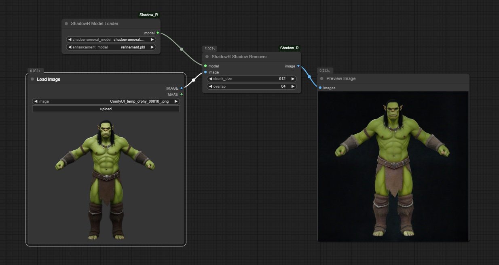

# ComfyUI-ShadowR
ComfyUI [movingforward100/Shadow_R](https://github.com/movingforward100/Shadow_R) Wrapper

# Installation
Download [weights](https://drive.google.com/file/d/1ntXl9vGVOFGel1-Pu1vbbWidOU3QH-IM/view) to `ComfyUI\models\shadow_r`

Run `python_embeded\python.exe -m pip install -r requirements.txt` in `ComfyUI-Shadow_R` directory

# Change Log
- Added chunking to speed things up significantly

# Credits

Special thanks to VisualBruno at the Tencent Hunyuan community discord for providing initial code
